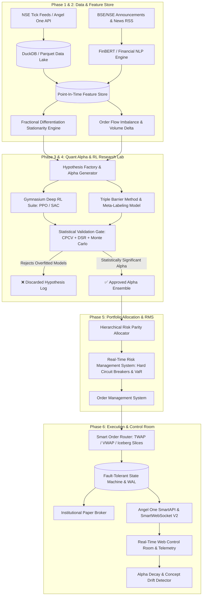
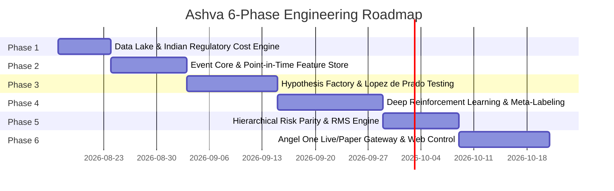

# ASHVA: Autonomous Quantitative Alpha & Algorithmic Trading Platform
## Institutional Master Blueprint & System Architecture

```
███████╗███████╗██╗  ██╗██╗   ██╗ █████╗ 
██╔════╝██╔════╝██║  ██║██║   ██║██╔══██╗
███████╗███████╗███████║██║   ██║███████║
╚════██║╚════██║██╔══██║╚╗   ██╔╝██╔══██║
███████║███████║██║  ██║ ╚████╔╝ ██║  ██║
╚══════╝╚══════╝╚═╝  ╚═╝  ╚═══╝  ╚═╝  ╚═╝
Autonomous Systematic Hedge-Fund Grade Quantitative Trading Engine
Market: National Stock Exchange of India (NSE) | Broker: Angel One SmartAPI
```

---

## Executive Overview

**Ashva** is an autonomous, quantitative trading platform designed to research, validate, risk-manage, and execute systematic trading strategies in the Indian financial markets. Moving beyond naive retail indicators, Ashva implements the **Scientific Alpha Lifecycle** popularized by Tier-1 quantitative hedge funds:
1. Formulating market microstructure and economic hypotheses.
2. Building point-in-time features with memory preservation (Fractional Differentiation) and NLP news sentiment.
3. Filtering false discoveries using Marcos López de Prado's statistical frameworks (Deflated Sharpe Ratio, Combinatorial Purged Cross-Validation).
4. Training Deep Reinforcement Learning agents and Meta-Labeling ensembles.
5. Allocating capital dynamically via Hierarchical Risk Parity (HRP).
6. Executing with microsecond event routing, smart slicing (TWAP/VWAP), and exact Indian regulatory cost modeling (STT, GST, SEBI, Stamp Duty, Brokerage).

---

## Master Architecture Flow



---

## The 6-Phase Master Blueprint



---

### Phase 1: Foundation, Data Lake & Indian Regulatory Cost Engine
**Objective**: Build the unshakeable foundation for high-speed local data management and accurate Indian financial friction accounting.

1. **High-Performance Data Lake**:
   - DuckDB & Apache Parquet columnar storage on local NVMe.
   - Dual-source ingestion: **Angel One SmartAPI Historical API** (1m, 5m, 15m, 60m, 1d) + **Yahoo Finance / Bhavcopy Fallback**.
   - Automatic corporate action adjustments (Stock splits, bonus issues, cash dividends).
2. **Indian Regulatory & Friction Cost Engine (`IndianCostModel`)**:
   - Exact mathematical breakdown of all Indian taxes and levies:
     - **Securities Transaction Tax (STT)**: 0.025% on sell side (Equity Intraday), 0.1% on both buy/sell (Equity Delivery), 0.0125% on sell (Futures), 0.0625% on sell (Options turnover).
     - **Angel One Brokerage**: Flat ₹20 or 0.03% (whichever is lower) per executed order.
     - **Exchange Turnover Charges**: NSE 0.00325%, BSE 0.00375%.
     - **Goods & Services Tax (GST)**: 18% on (Brokerage + Exchange charges + SEBI charges).
     - **SEBI Turnover Charges**: ₹10 per crore (0.0001%).
     - **Stamp Duty**: 0.003% on buy side (Equity Intraday), 0.015% (Delivery), 0.002% (Futures).
     - **Bid-Ask Slippage & Market Impact Model**: Fixed basis points + volatility-adjusted square-root market impact law.

---

### Phase 2: Event-Driven Framework & Point-in-Time Feature Store
**Objective**: Create the low-latency asynchronous event engine and institutional feature engineering suite.

1. **High-Speed Async Event Bus (`asyncio` / uvloop)**:
   - Zero-copy internal event dispatching for `TickEvent`, `BarEvent`, `FeatureEvent`, `SignalEvent`, `OrderEvent`, `FillEvent`, `RiskEvent`.
2. **Fractional Differentiation Engine**:
   - Implements $d$-order fractional differentiation ($\text{FracDiff}$) to ensure price stationarity for statistical/ML modeling while preserving maximum long-term memory ($d \in [0.2, 0.6]$).
3. **Market Microstructure & Order Flow Features**:
   - **Order Flow Imbalance (OFI)** and Volume Delta.
   - **Anchored VWAP** with standard deviation dispersion bands.
   - **Roll Spread & Kyle’s Lambda** for illiquidity and market depth estimation.
   - **Opening Range Dynamic Volatility Bands** (09:15–09:45 AM institutional basket flow).
4. **Alternative Data & Financial NLP Engine**:
   - RSS & Web Scraper for corporate filings on BSE/NSE and financial news (Moneycontrol, Economic Times).
   - FinBERT / lightweight LLM sentiment and entity extractor (`TICKER`, `SENTIMENT_SCORE`, `URGENCY_INDEX`).

---

### Phase 3: Alpha Research Lab, Hypothesis Generator & Lopez de Prado Statistical Validator
**Objective**: Systematically formulate structural hypotheses, generate candidate trading models, and aggressively filter false discoveries using hedge-fund statistical rigor.

1. **Hypothesis Generation Engine**:
   - Base class for formal market hypotheses with explicit economic rationales.
   - Parameter space generator (grid, random, and Bayesian exploration).
2. **The Triple-Barrier Method**:
   - Dynamic labeling using volatility-adjusted profit-taking barriers, stop-loss barriers, and time-decay horizons.
3. **Statistical Validation & Overfitting Rejection Pipeline**:
   - **Combinatorial Purged & Embargoed Cross-Validation (CPCV)**: Prevents data leakage and serial correlation biases in time-series data.
   - **Deflated Sharpe Ratio (DSR)**: Penalizes performance metrics for multiple testing, skewness, and fat-tailed kurtosis.
   - **False Discovery Rate (FDR) / Benjamini-Hochberg Control**: Eliminates strategies that pass purely due to selection bias.
   - **Monte Carlo Permutation Stress Testing (10,000 runs)**: Shuffles trade sequences and simulates black-swan volatility shocks to stress-test tail risk.

---

### Phase 4: Deep Reinforcement Learning & Machine Learning Meta-Labeling
**Objective**: Train adaptive intelligent agents and secondary sizing filters that continuously optimize exposure.

1. **Custom Gymnasium Trading Environment (`AshvaTradingEnv`)**:
   - State Space: Fractionally differenced OHLCV, Volume Delta, Anchored VWAP distance, Volatility Regime, NLP sentiment score, and current position holding.
   - Action Space: Continuous position allocation $[-1.0, +1.0]$ with strict action masking for circuit limits and margin limits.
   - Reward Shaping: Differential Sharpe/Sortino reward with severe penalties for transaction costs, excessive turnover, and portfolio drawdown.
2. **Deep Reinforcement Learning (DRL) Algorithms**:
   - **Proximal Policy Optimization (PPO)** with Recurrent LSTM memory for temporal sequence processing.
   - **Soft Actor-Critic (SAC)** for maximum entropy exploration in volatile market regimes.
3. **Meta-Labeling ML Ensemble**:
   - Primary model generates trading direction; secondary meta-model (XGBoost/LightGBM) predicts the probability of success to dynamically adjust position size (sizing up on high conviction, skipping low conviction).

---

### Phase 5: Hierarchical Risk Parity (HRP) Portfolio Engine & Real-Time RMS
**Objective**: Construct an uncorrelated multi-strategy portfolio and enforce multi-tiered institutional risk circuit breakers.

1. **Hierarchical Risk Parity (HRP) Allocator**:
   - Uses graph-theory hierarchical tree clustering to allocate capital across uncorrelated strategies and assets, avoiding the mathematical instability of Markowitz mean-variance optimization.
2. **Real-Time Risk Management System (RMS)**:
   - **Fund-Level Hard Circuit Breaker**: Immediate execution halt and position flattening if daily drawdown reaches $1.5\%$ of total portfolio capital.
   - **Strategy-Level Trailing Stop & Max Drawdown Ceilings**.
   - **Real-Time Value at Risk (VaR)** and **Conditional Value at Risk (CVaR / Expected Shortfall)**.
   - **Volatility-Based Position Sizing**: Kelly Criterion with fractional safety scalar ($0.25\times \text{Half-Kelly}$) and ATR-based dollar risk parity.

---

### Phase 6: Execution Gateway (Angel One SmartAPI) & Real-Time Control Room
**Objective**: Deploy the fault-tolerant live/paper execution gateway, smart execution algorithms, and telemetry monitoring.

1. **Angel One SmartAPI Gateway & SmartWebSocket V2**:
   - Automated daily session login via **TOTP (Time-based One-Time Password)**.
   - Real-time tick ingestion via SmartWebSocket V2 with heartbeat management and auto-reconnect.
   - Order execution for Intraday (MIS), Delivery (CNC), and GTT (Good-Till-Triggered).
2. **Smart Order Router (SOR) & Execution Algorithms**:
   - **Time-Weighted Average Price (TWAP)** and **Volume-Weighted Average Price (VWAP)** order slicing.
   - **Iceberg Orders** to avoid displaying full block size in the market depth.
3. **Fault-Tolerant State Machine (WAL)**:
   - SQLite/DuckDB Write-Ahead Logging to restore active orders, open positions, and state in $<100\text{ms}$ upon power or network interruption.
4. **Institutional Paper Trading Broker**:
   - High-fidelity execution simulator with realistic queue position modeling, simulated latency, and bid-ask slippage.
5. **Web Control Room & MLOps Drift Monitor**:
   - Interactive real-time dashboard displaying streaming PnL, equity curves, active risk metrics, strategy allocations, and emergency kill switches.
   - **Concept Drift & Alpha Decay Detector**: Continuous Kolmogorov-Smirnov statistical testing comparing live returns against backtested distributions to flag decaying alphas.
   - **Telegram / Discord Incident Dispatcher** for real-time trade fills, circuit breaches, and heartbeat health checks.

---

## Directory & File Structure

```
Ashva/
├── ASHVA_QUANT_BLUEPRINT.md    # Master Architecture Specification
├── config/
│   ├── angel_one.yaml          # SmartAPI credentials, API key, Client code, TOTP secret
│   ├── settings.yaml           # Global fund settings, capital, universe, logging
│   └── risk_limits.yaml        # Hard circuit breaker limits, Max daily loss, Max VaR
├── src/
│   ├── core/
│   │   ├── events.py           # Typed event dataclasses (Tick, Bar, Signal, Order, Fill, Risk)
│   │   ├── event_bus.py        # High-performance async event dispatcher
│   │   └── state_machine.py    # WAL crash-resilient state store
│   ├── data/
│   │   ├── angel_historical.py # Angel One SmartAPI historical OHLCV downloader
│   │   ├── data_lake.py        # DuckDB / Parquet local columnar storage layer
│   │   ├── yfinance_loader.py  # Secondary historical data loader for offline research
│   │   └── live_feed.py        # Angel One SmartWebSocket V2 live tick stream
│   ├── features/
│   │   ├── frac_diff.py        # Fractional differentiation stationarity engine
│   │   ├── microstructure.py   # Order flow imbalance, volume delta, anchored VWAP
│   │   └── nlp_sentiment.py    # Financial news & corporate announcement NLP pipeline
│   ├── research/
│   │   ├── hypothesis.py       # Abstract Base Hypothesis class
│   │   ├── hypothesis_factory.py # Systematic parameter generator
│   │   ├── triple_barrier.py   # Triple-barrier labeling method
│   │   └── validator.py        # CPCV, Deflated Sharpe Ratio, Monte Carlo permutation
│   ├── strategies/
│   │   ├── base.py             # Abstract Strategy Interface
│   │   ├── alpha_orb.py        # Alpha 1: Institutional Opening Range & VWAP Breakout
│   │   ├── alpha_regime.py     # Alpha 2: Volatility-Regime Switched Mean Reversion
│   │   ├── alpha_meta.py       # Alpha 3: ML Meta-Labeled Model
│   │   └── alpha_rl/           # Alpha 4: Deep Reinforcement Learning Agent
│   │       ├── env.py          # Custom Gymnasium Trading Environment
│   │       ├── ppo_agent.py    # Recurrent PPO RL Agent
│   │       └── train.py        # RL Training pipeline with reward shaping
│   ├── portfolio/
│   │   └── hrp_allocator.py    # Hierarchical Risk Parity strategy allocator
│   ├── risk/
│   │   ├── risk_manager.py     # Real-time RMS, daily loss circuit breakers, kill-switches
│   │   ├── var_calculator.py   # Parametric & Historical VaR / CVaR engine
│   │   └── position_sizer.py   # Fractional Kelly & Volatility Parity sizing
│   ├── execution/
│   │   ├── paper_broker.py     # High-fidelity paper trading broker
│   │   ├── angel_broker.py     # Angel One SmartAPI live order gateway
│   │   └── smart_router.py     # TWAP / VWAP / Iceberg execution slicer
│   ├── analytics/
│   │   ├── indian_costs.py     # Precise STT, GST, Stamp, SEBI, Brokerage, Slippage
│   │   ├── tearsheet.py        # Fund-house quantitative performance tearsheets
│   │   └── drift_detector.py   # Alpha decay & Kolmogorov-Smirnov drift test
│   ├── ui/
│   │   ├── app.py              # Real-time Web Control Room application
│   │   └── static/             # Visual dashboard assets & charts
│   └── notifications/
│       └── notifier.py         # Telegram / Discord alert dispatcher
├── scripts/
│   ├── run_data_sync.py        # CLI to download and sync historical data to DuckDB
│   ├── run_hypothesis_lab.py   # CLI to generate, test, and accept/reject hypotheses
│   ├── run_rl_train.py         # CLI to train and evaluate Reinforcement Learning models
│   ├── run_backtest.py         # CLI to backtest approved strategy ensemble
│   ├── run_paper_bot.py        # CLI to run real-time live paper trading
│   └── run_live_bot.py         # CLI for real-money execution with multi-stage safety
├── tests/
│   ├── test_indian_costs.py    # Unit tests for exact Indian tax & brokerage calculations
│   ├── test_frac_diff.py       # Unit tests for fractional differentiation
│   ├── test_validator.py       # Unit tests for DSR and CPCV cross-validation
│   ├── test_risk_manager.py    # Unit tests for hard risk circuit breakers
│   └── test_angel_smartapi.py  # Mock tests for Angel One API integration
├── requirements.txt            # Complete Python dependency specifications
└── README.md                   # System documentation & quickstart guide
```

---

*This master blueprint serves as the permanent architectural foundation for Ashva. Every component is designed for modularity, strict statistical validation, capital preservation, and institutional-grade reliability.*
