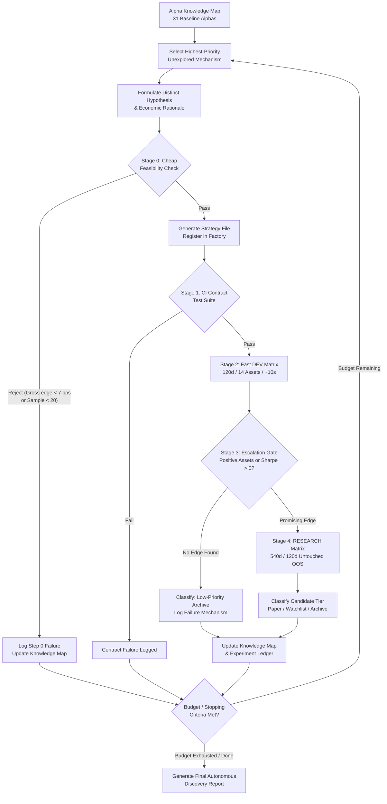

# Ashva Factory v2 — Autonomous Alpha Discovery Controller
## Comprehensive Implementation Plan & Architectural Blueprint

**Platform Version**: `Ashva Factory v2 (Controller Layer)`  
**Infrastructure Freeze Status**: 🔒 `FACTORY v1 CORE FROZEN` (`BacktestEngine`, `DataLake`, `IndianCostModel`, `StatisticalValidator`, `BaseHypothesis` Contract)  
**Date**: `2026-08-19`  
**Primary Goal**: Build the smallest, deterministic, auditable research controller that autonomously navigates the quantitative alpha landscape, avoids duplication, conducts cheap feasibility checks, enforces research budgets, and escalates computation intelligently.

---

## 1. Existing Capabilities We Can Reuse

The Ashva Factory v1 already provides a complete, hardened quantitative research stack. Factory v2 requires **zero modifications** to these existing modules:

```text
┌─────────────────────────────────────────────────────────────────────────────┐
│                            REUSED INFRASTRUCTURE                            │
├─────────────────────────────────────────────────────────────────────────────┤
│ 1. DataLake (src/data/data_lake.py)                                         │
│    • DuckDB + Parquet partitioned storage with 540-day lookback ceiling.     │
│    • Native resampling across 5m, 15m, 30m, 60m, and daily intervals.        │
│                                                                             │
│ 2. BacktestEngine (src/backtest/engine.py)                                  │
│    • Strict next-bar open fill execution (entry_price = next_open).          │
│    • Intrabar SL/TP evaluation with gap slippage modeling.                   │
│    • Capital isolation & dynamic sizing per asset (₹500,000 baseline).       │
│                                                                             │
│ 3. IndianCostModel (src/backtest/cost_model.py)                             │
│    • Statutory schedule: STT (sell only), GST 18%, Stamp Duty (buy only),   │
│      SEBI & NSE turnover charges, ₹20 Angel One cap, 3.0 bps slippage.      │
│                                                                             │
│ 4. BaseHypothesis & Contract Suite (src/research/hypothesis.py, tests/)     │
│    • Dense state signal semantics (+1.0 / -1.0 / 0.0), SL/TP targets.       │
│    • Automated CI contract test suite (tests/test_strategy_contracts.py).   │
│                                                                             │
│ 5. StatisticalValidator (src/research/validator.py)                         │
│    • Deflated Sharpe Ratio (DSR) trial-correction, CPCV cross-validation,    │
│      Monte Carlo 95% Max Drawdown, and 420d IS / 120d Untouched OOS splits. │
│                                                                             │
│ 6. ResearchExperimentLedger (src/research/experiment_ledger.py)             │
│    • SQLite & JSONL immutable trial journaling with Git commit SHA tagging. │
│                                                                             │
│ 7. Multi-Mode Audit Matrix (scripts/run_alpha_matrix_audit.py)              │
│    • DEV Mode (~10s, 120d, NIFTY-14) for fast rapid-feedback loops.         │
│    • RESEARCH Mode (~10m, 540d, NIFTY-14) for formal validation.            │
│    • FULL Mode (~25m, 540d, NIFTY-50) for broad generalization audits.      │
└─────────────────────────────────────────────────────────────────────────────┘
```

---

## 2. Minimum New Components Required

To enable autonomous orchestration without bloat, Factory v2 introduces only **two lightweight Python modules** and **one CLI controller**:

```text
src/research/
├── knowledge_map.py          <-- [NEW] Structured Knowledge Registry & Mechanism Taxonomy
├── discovery_controller.py   <-- [NEW] Autonomous Alpha Discovery Orchestrator
└── ... (existing ledger, validator, hypothesis)

scripts/
└── run_autonomous_discovery.py <-- [NEW] CLI Entry Point & Campaign Runner
```

### Component Details:

1. **`src/research/knowledge_map.py` (`AlphaKnowledgeMap`)**:
   - Maintains a structured taxonomy of market mechanisms (Opening Imbalance, Gap Continuation, Relative Strength, Sector Drift, Swing Range Reversion, Volatility Squeeze, Auction Microstructure, etc.).
   - Ingests all historical baseline results (Alphas 01–31).
   - Categorizes mechanisms into 4 operational states:
     - `PROVEN` (Evidence of positive post-cost OOS edge, e.g. Gap Momentum Drift, IT Sector Leadership, Multi-Day Swing Reversion).
     - `EXPLORED_FAILED` (Repeated empirical failures under Indian friction, e.g. Midday Breakouts, Cross-Sectional Mean Reversion, High-Frequency VWAP Sweeps).
     - `EXPLORED_UNCERTAIN` (Mixed asset results or low sample size, e.g. Low-Frequency Gap & Go).
     - `UNEXPLORED` (High-plausibility mechanisms with zero or minimal prior testing).
   - Computes **Mechanism Distance** to ensure new hypotheses are orthogonal and not cosmetic duplicates of failed strategies.

2. **`src/research/discovery_controller.py` (`AutonomousDiscoveryController`)**:
   - Executes the closed-loop autonomous research cycle.
   - Enforces configurable **Research Budgets** (`max_hypotheses`, `max_dev_runs`, `max_research_runs`, `max_runtime_sec`).
   - Orchestrates the 5-Stage Compute Escalation Ladder:
     - **Stage 0 (Step 0 Feasibility Check)**: Cheap empirical verification on raw DataLake bars (event frequency, average move magnitude vs 7.0 bps friction). Rejects unviable ideas in <2 seconds.
     - **Stage 1 (Contract Test)**: Verifies `BaseHypothesis` compliance via `pytest` in <5 seconds.
     - **Stage 2 (Fast DEV Audit)**: Runs 120d / NIFTY-14 matrix in ~10 seconds.
     - **Stage 3 (Escalation Gate)**: Evaluates DEV output. If DEV fails (<0 Sharpe, 0 positive assets), archives immediately and logs failure reason. If DEV is promising, escalates to Stage 4.
     - **Stage 4 (Full RESEARCH Audit)**: Runs 540d / 120d untouched OOS audit.
     - **Stage 5 (Knowledge Update)**: Records post-mortem in `AlphaKnowledgeMap` and `ResearchExperimentLedger`, updating subsequent exploration priorities.

3. **`scripts/run_autonomous_discovery.py`**:
   - Command-line runner allowing execution of single-step discovery, bounded test campaigns, or unattended batch discovery.

---

## 3. What Should NOT Be Changed (Factory Freeze Protection)

To preserve scientific rigor and prevent inadvertent lookahead or relaxed friction, the following modules are strictly **read-only and frozen**:

1. **`src/backtest/engine.py`**: Execution fills remain strictly `next_open`. Intrabar SL/TP logic, gap slippage rules, and capital allocations remain frozen.
2. **`src/backtest/cost_model.py`**: Indian statutory tax schedule and 3.0 bps slippage are immutable.
3. **`src/data/data_lake.py`**: 540-day lookback ceiling and Parquet storage contracts remain frozen.
4. **`src/research/hypothesis.py`**: `BaseHypothesis` abstract contract and dense signal state requirements remain frozen.
5. **Existing Strategy Implementations (`src/strategies/alpha_01` to `alpha_31`)**: Preserved as historical scientific record.

If any new hypothesis appears to require changing the execution engine or relaxing cost assumptions, the controller must **ABORT and log an infrastructure incompatibility error**, never modify the engine.

---

## 4. How Autonomous Discovery Should Work (The Research Loop)



---

## 5. How Research History Will Influence the Next Hypothesis

The discovery controller does not select hypotheses at random. It uses an **empirical failure-directed heuristic**:

1. **Failure Inversion / Directional Clues**:
   - *Example from Alpha 25*: When cross-sectional residual reversion failed decisively (fading large moves yielded 28% win rate), the controller learned that idiosyncratic divergence is **flow momentum**, prioritizing momentum/continuation studies over mean-reversion in that category.
2. **Time-of-Day Regime Pruning**:
   - *Example from Alphas 24, 28, 30*: When midday range breakouts (10:30 to 14:00) failed across 4 consecutive architectures due to market-maker liquidity absorption, the controller **demotes all midday breakout variations** and shifts focus to multi-day swing holding or opening microstructure.
3. **Sector & Asset Cluster Exploitation**:
   - *Example from Alphas 09 & 27*: When IT leadership (`INFY`, `TCS`) showed strong positive edges (+₹14.4k and +₹9.8k), the controller identifies macro export sectors as viable trend vehicles and avoids domestic banking churn for breakout designs.
4. **Timeframe Adaptation**:
   - *Example from Alpha 10*: When intraday mean reversion failed but multi-day swing holding generated +₹22.6k on `MARUTI`, the controller recognizes that certain asset classes require multi-session holding horizons to amortize round-trip taxes.

---

## 6. How to Prevent Hypothesis Duplication

To prevent the endless generation of cosmetic variations (e.g. changing an ATR multiplier from 1.5 to 1.6), the controller enforces **Mechanism Distance**:

```python
class AlphaDuplicationFilter:
    """
    Prevents duplicate or cosmetic alpha generation by validating mechanism novelty.
    """
    def is_novel_hypothesis(self, candidate_meta: HypothesisMetadata, existing_alphas: List[HypothesisMetadata]) -> bool:
        for alpha in existing_alphas:
            # Reject if identical mechanism AND identical timeframe AND identical entry window
            if (candidate_meta.mechanism == alpha.mechanism and 
                candidate_meta.timeframe == alpha.timeframe and 
                candidate_meta.category == alpha.category):
                return False
        return True
```

A candidate hypothesis is rejected before generation if:
1. It shares the same core mechanism, category, and timeframe as an existing tested strategy without a fundamentally distinct economic trigger.
2. It represents a cosmetic parameter tweak of an existing failed alpha.

---

## 7. How to Prevent Overfitting

1. **No Parameter Mining**: The controller tests hypotheses under **fixed, economically intuitive default parameters** (e.g. 1.5–2.0 ATR stops, standard 20-period lookbacks). It never optimizes parameters on historical data to turn a negative strategy positive.
2. **Strict Step 0 Feasibility Filter**: Before writing strategy code, the controller checks whether the hypothesized market inefficiency exists in raw data. If the gross edge is $< 7.0\text{ bps}$, it is discarded immediately.
3. **Untouched OOS Isolation**: The 120-day Out-Of-Sample window is strictly reserved for the final Stage 4 evaluation. The controller never tunes or filters strategies based on OOS results.
4. **Deflated Sharpe Ratio (DSR)**: The `ResearchExperimentLedger` tracks every trial ($N$) to penalize selection bias and compute rigorous family-wise error-corrected p-values.

---

## 8. How to Prevent Endless Generation of Useless Alphas

The discovery controller operates under strict **Stopping Criteria & Research Budgets**:

```python
@dataclass
class ResearchBudget:
    max_hypotheses: int = 5         # Maximum new hypotheses generated in a run
    max_dev_runs: int = 5           # Maximum DEV matrix executions
    max_research_runs: int = 2      # Maximum expensive 540d RESEARCH executions
    max_runtime_seconds: int = 1800 # 30-minute maximum run budget
    target_promising_alphas: int = 2 # Early exit if 2 strong candidates found
```

The controller halts execution when:
1. The hypothesis budget or time limit is reached.
2. All high-priority unexplored mechanism categories in the Knowledge Map have been evaluated.
3. Two strong paper candidates have been discovered and validated.

---

## 9. How Compute Will Be Controlled (5-Stage Escalation)

| Stage | Name | Target Lookback | Universe | Typical Runtime | Failure Action |
| :---: | :--- | :---: | :---: | :---: | :--- |
| **Stage 0** | Cheap Feasibility Check | 180d | NIFTY-14 | **< 2 seconds** | Discard idea immediately; log rejection in Knowledge Map. |
| **Stage 1** | Contract CI Verification | Synthetic | Single Asset | **< 5 seconds** | Abort or fix contract syntax defect. |
| **Stage 2** | Fast DEV Matrix | 120d (90d IS / 30d OOS) | NIFTY-14 | **~10 seconds** | If Net PnL < 0 and 0 positive assets $\rightarrow$ Archive immediately. |
| **Stage 3** | Escalation Gate | DEV Metrics | NIFTY-14 | **< 1 second** | Promote to Stage 4 ONLY if DEV Sharpe $> 0$ or strong asset cluster ($\ge 2$ positive pairs). |
| **Stage 4** | Formal RESEARCH Matrix | 540d (420d IS / 120d OOS) | NIFTY-14 | **~20 seconds** (targeted) | Formal DSR, CPCV, and multi-window audit. |
| **Stage 5** | FULL Universe Scan | 540d | NIFTY-50 | **~25 minutes** | Run ONLY for Tier 1 Paper Candidates on user demand. |

*Result*: 90% of non-viable ideas are filtered at Stage 0 (< 2s) or Stage 2 (~10s), preventing expensive 540d research runs on noise.

---

## 10. How Results Will Be Reproducible

1. **Deterministic Execution**: All indicators, signals, and backtester fills are strictly vectorized and deterministic. No random seeds or non-deterministic loops.
2. **Immutable Experiment Ledger**: Every run is logged to `data_lake/experiment_ledger.db` and JSONL with:
   - Experiment ID, Strategy ID, Parameters JSON
   - Git Commit SHA (ensuring exact code commit traceability)
   - In-Sample Sharpe, CPCV OOS Sharpe, DSR p-value, Net PnL, Max Drawdown
   - Explicit Rejection/Promotion Rationale
3. **Structured Final Output**: Generates `autonomous_discovery_report.md` summarizing research conclusions, mechanism map evolution, and candidate rankings.

---

## Proposed Phase-Wise Implementation Roadmap

### Phase 1: Implementation Plan Review & Validation
- [x] Audit current codebase and baseline results.
- [x] Create `factory_v2_implementation_plan.md` artifact and repository file.
- [ ] **STOP AND WAIT FOR USER REVIEW & APPROVAL.**

### Phase 2: Core Controller Implementation (Post-Approval)
- [ ] Implement `src/research/knowledge_map.py` (Ingesting Alphas 01–31 baseline).
- [ ] Implement `src/research/discovery_controller.py` (5-Stage Escalation & Budget Manager).
- [ ] Implement `scripts/run_autonomous_discovery.py` (CLI runner).

### Phase 3: Small Controlled Controller Test
- [ ] Run a bounded test campaign (e.g. Budget = 2 hypotheses).
- [ ] Demonstrate:
  1. Knowledge map correctly recognizes Alphas 01–31.
  2. Avoids duplicate hypotheses.
  3. Executes Stage 0 feasibility check.
  4. Runs Stage 1 CI & Stage 2 DEV matrix.
  5. Correctly archives/escalates and updates ledger.
- [ ] Verify test results with pytest and Git commit.

### Phase 4: Autonomous Campaign Execution & Reporting
- [ ] Run a disciplined discovery campaign under strict research budgets.
- [ ] Produce `autonomous_discovery_report.md`.
- [ ] Commit and push to Git (`git push origin main`).
